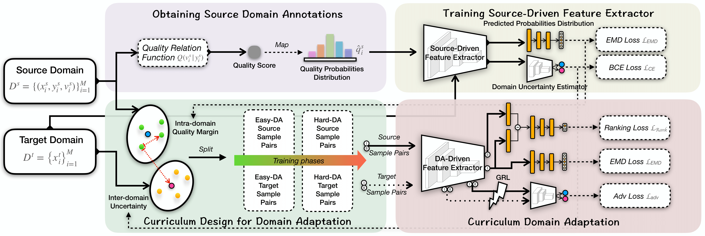

# Troubleshooting Ethnic Quality Bias with Curriculum Domain Adaptation for Face Image Quality Assessment

## Abstract
####
Face Image Quality Assessment (FIQA) lays the foundation for ensuring the stability and accuracy of face recognition systems. However, existing FIQA methods mainly formulate quality relationships within the training set to yield quality scores, ignoring the generalization problem caused by ethnic quality bias between the training and test sets. Domain adaptation presents a potential solution to mitigate the bias, but if FIQA is treated essentially as a regression task, it will be limited by the challenge of feature scaling in transfer learning. Additionally, how to guarantee source risk is also an issue due to the lack of ground-truth labels of the source domain for FIQA. This paper presents the first attempt in the field of FIQA to address these challenges with a novel curriculum domain adaptation approach. Specifically, to eliminate the restriction of scalar regression, we first compute Likert-scale quality probability distributions as source domain annotations. Furthermore, we design an easy-to-hard training scheduler based on the inter-domain uncertainty and intra-domain quality margin as well as the ranking-based domain adversarial network to enhance the effectiveness of transfer learning and further reduce the source risk in domain adaptation. Extensive experiments demonstrate that the proposed method significantly mitigates the quality bias and improves the generalization capability of FIQA across races on different datasets. 


## Training
Run ./train.py

## Inference
Run './inference.py' to predict the face quality score.
We also provide different pre-trained EQBM-S models on African, Asian, and Indian groups at ./checkpoints/

## Citing this Repository
If you find this code useful in your research, please consider citing us:
```
@InProceedings{EQBM2023,
    author    = {Ou, Fu-Zhao and Chen, Baoliang and Li, Chongyi and Wang, Shiqi and Kwong, Sam},
    title     = {Troubleshooting Ethnic Quality Bias with Curriculum Domain Adaptation for Face Image Quality Assessment},
    booktitle = {Proceedings of the IEEE/CVF International Conference on Computer Vision (ICCV)},
    month     = {October},
    year      = {2023},
    pages     = {20718-20729}
}
```
